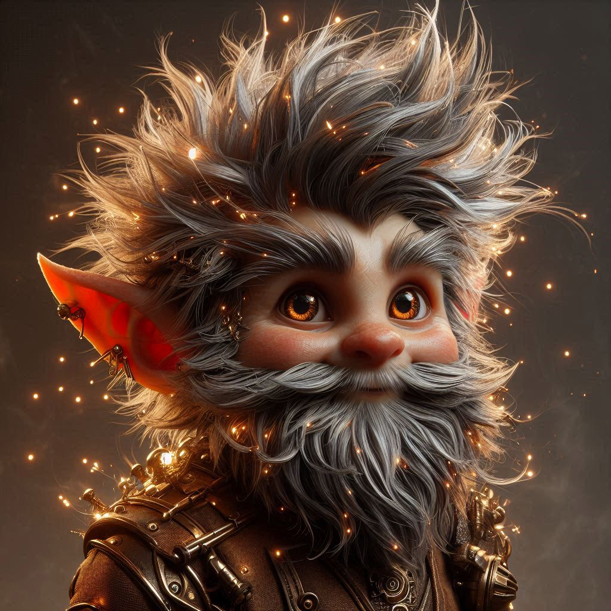

# Fizz Funkenwitz

## Grundinformationen
- **Rasse:** Gnom
- **Klasse:** Artificer
- **Alter:** 42
- **Größe:** 0,95m
- **Gewicht:** 18kg
- **Alignment:** Chaotisch Gut

## Erscheinung & Aussehen
Fizz ist ein rundlicher, energiegeladener Gnom mit strubbeligen, metallisch schimmernden Haaren, die ständig von kleinen Funken durchzuckt werden. Seine Augen sind von unterschiedlicher Farbe - das linke golden wie poliertes Messing, das rechte silbern wie Quecksilber. Seine Haut hat einen leichten Bronzeton, übersät mit winzigen Zahnradförmigen Sommersprossen.

Er trägt einen fantastischen "Multifunktionsoverall" seiner eigenen Erfindung, der mit zahllosen Taschen, Werkzeughaltern und ausklappbaren Mechanismen versehen ist. Auf seinem Rücken trägt er einen komplizierten Apparat, der wie ein Rucksack aussieht, sich aber bei Bedarf in eine mobile Werkstatt verwandeln kann. Seine Stiefel haben eingebaute Sprungfedern, die manchmal ein Eigenleben entwickeln.

## Besondere Eigenschaft
Fizz hat die außergewöhnliche Fähigkeit, mit Maschinen zu flüstern. Er kann defekte mechanische Geräte durch sanftes Zureden und leichtes Streicheln reparieren. Allerdings entwickeln diese reparierten Geräte oft eigenwillige Persönlichkeiten. Die Maschinen reagieren auf seine Stimme mit leisen Summtönen und sanftem Vibrieren, als würden sie schnurren.

## Hintergrundgeschichte
Als Kind einer fahrenden Gnomenfamilie von Uhrmachern entdeckte Fizz seine Gabe, als er versehentlich eine ganze Sammlung kaputter Uhren zum Leben erweckte. Diese Uhren begannen daraufhin, synchron zu ticken und eine komplexe Melodie zu spielen.

Seine frühe Kindheit war geprägt von ständigen Umzügen, da seine "reparierten" Geräte oft für Chaos sorgten - von selbstständig patrouillierenden Teekesseln bis zu einer Waschmaschine, die beschloss, die lokale Theatergruppe zu leiten. Seine Eltern erkannten schließlich, dass seine Gabe etwas Besonderes war, und ermutigten ihn, sie zu entwickeln.

Heute reist er mit seinem "Zirkus der lebenden Maschinen" durch die Lande - einer faszinierenden Sammlung reparierter Automaten, die alle ihre eigenen Persönlichkeiten und Talente haben. Sein größter Stolz ist eine selbstspielende Orgel namens "Melodia", die ihre Musik an die Gefühle ihrer Zuhörer anpasst und gelegentlich eigene Kompositionen schreibt.

## Persönlichkeit
- Spricht mit jedem mechanischen Gerät wie mit einem Freund und stellt sie anderen formell vor
- Sammelt zwanghaft kaputte Maschinen, überzeugt davon, dass jede eine "zweite Chance" verdient
- Hat die Angewohnheit, in Zahnrad-Metaphern zu sprechen
- Wird extrem beschützend, wenn jemand seine "Maschinenfamilie" beleidigt
- Vergisst oft, dass nicht alle seine Erfindungen für andere sichtbar sind
- Führt ausführliche Gespräche mit seinen Maschinen und lacht über ihre "Witze"
- Hat eine besondere Schwäche für alte, handgefertigte Mechanismen
- Kann stundenlang über die "Persönlichkeiten" verschiedener Metallarten referieren
- Glaubt fest daran, dass jede Maschine eine Seele hat
- Wird melancholisch, wenn er rostige oder vernachlässigte Geräte sieht

## Zitate
"Nein, nein, du musst sie sanft behandeln! Zahnräder sind sehr sensibel, weißt du?"
"Natürlich hat sie eine eigene Persönlichkeit - hast du nicht gehört, wie liebevoll sie schnurrt?"
"Das ist kein Defekt, das ist ein Charakterzug! Meine Erfindungen sind eben... individuell."